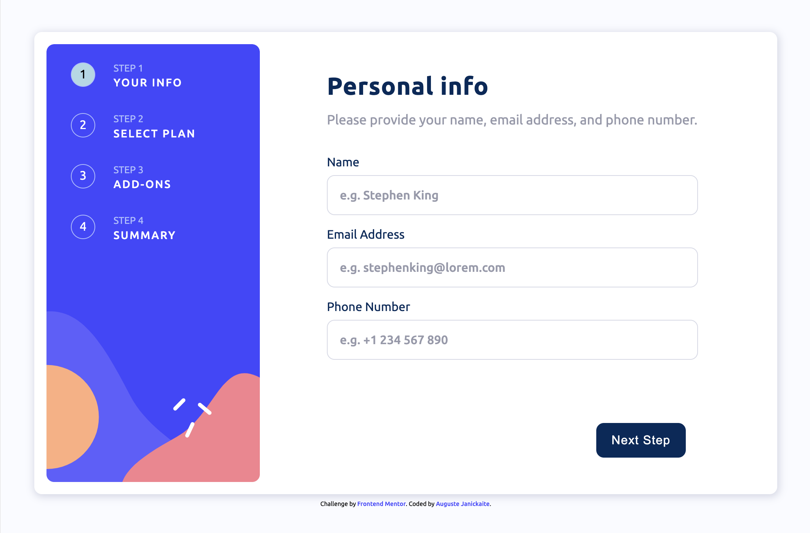

# Frontend Mentor - Multi-step form solution

This is a solution to the [Multi-step form challenge on Frontend Mentor](https://www.frontendmentor.io/challenges/multistep-form-YVAnSdqQBJ). Frontend Mentor challenges help you improve your coding skills by building realistic projects. 

## Table of contents

- [Overview](#overview)
  - [The challenge](#the-challenge)
  - [Screenshot](#screenshot)
  - [Links](#links)
- [My process](#my-process)
  - [Built with](#built-with)
  - [What I learned](#what-i-learned)
  - [Continued development](#continued-development)
- [Author](#author)

## Overview

### The challenge
- Challenge included examples of 1440px and 375px width screens
- I did not use Pro account features (no Figma, most of design margins/font-size was my best guess)

Users should be able to:

- Complete each step of the sequence
- See a summary of their selections on the final step and confirm their order
- View the optimal layout for the interface depending on their device's screen size
- See hover and focus states for all interactive elements on the page

### Screenshot

### Links

- Live Site URL: (https://augustej.github.io/FEnd-Mentor-Multistep-Form/)

## My process

### Built with

- Semantic HTML5 markup
- Object Oriented JS
- SCSS custom properties
- Flexbox
- CSS Grid
- Mobile-first workflow

### What I learned

- How to use JS object oriented style (my first time)
- How to use float property to make text float around image
- How to use SCSS (my first time)
- How to style checkbox and ol elements

### Continued development

I would like to continue using OO JS, because it makes my code cleaner. However, it requires extra effort and I hope to improve my skills and turn it into my usual mindflow and workflow.

## Author

- Website - [augustej](https://augustej.github.io/)
- Frontend Mentor - [@augustej](https://www.frontendmentor.io/profile/augustej)